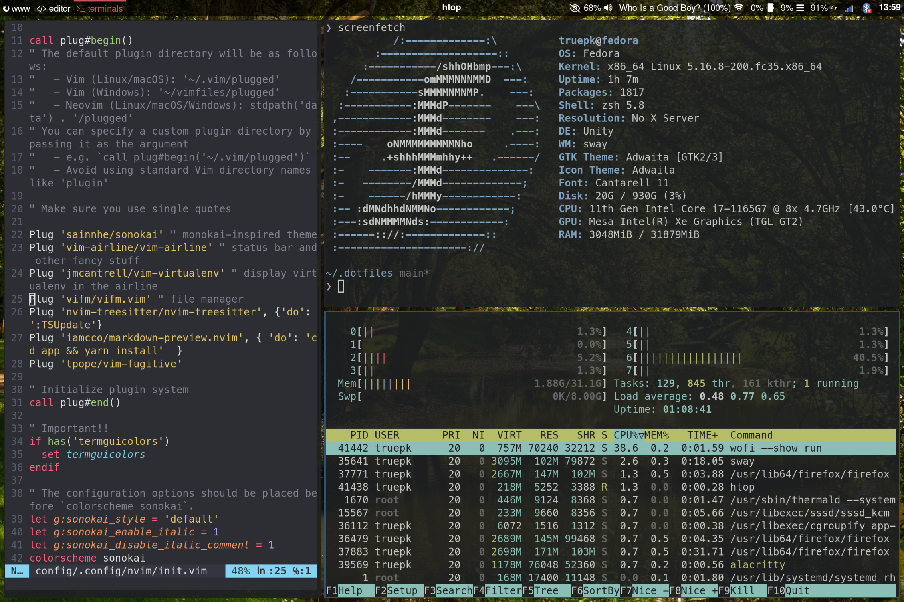

# Dotfiles

Welcome to my dotfiles! All configurations are work in progress and will continue to evolve as I learn new things and optimize my environment over time. I highly recommend to not copy everything blindly but rather understand each configuration individually and how it can improve your own setup.

### Environment
* [Fedora](https://getfedora.org/) as OS
* [Sway](https://swaywm.org/) as window manager
* [Alacritty](https://alacritty.org/) as terminal
* [Neovim](https://neovim.io/) as text editor
* [Vifm](https://vifm.info/) as file manager
* [Waybar](https://github.com/Alexays/Waybar) as status bar for Wayland
* [Wofi](https://hg.sr.ht/~scoopta/wofi) as application launcher

### Screenshots

